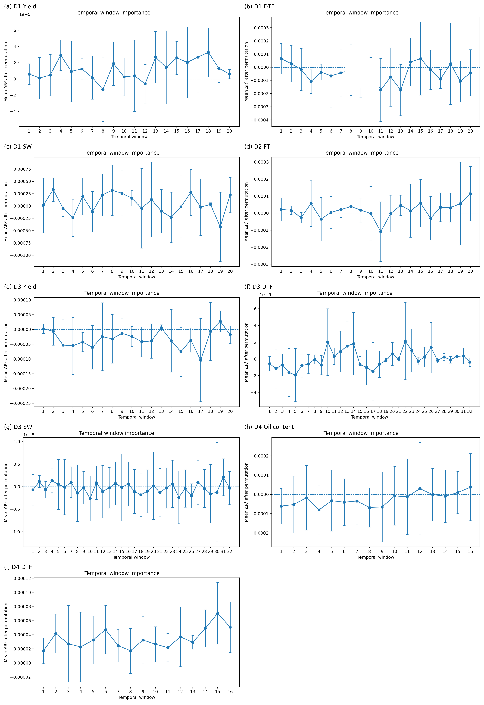
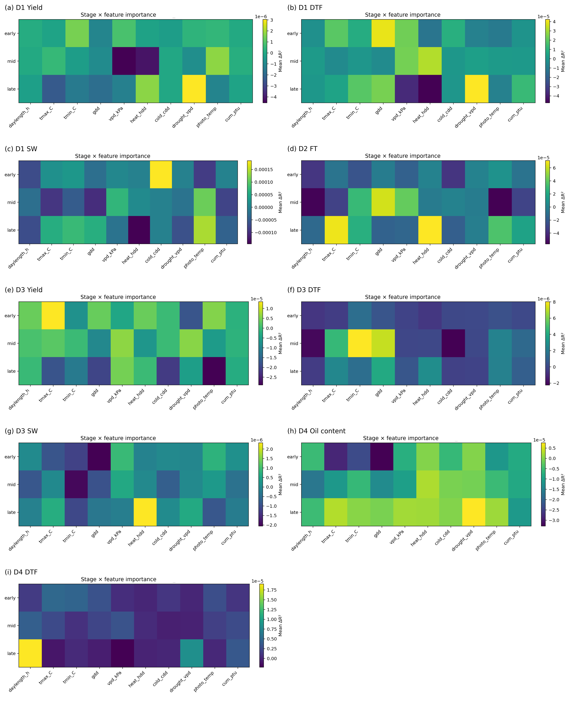
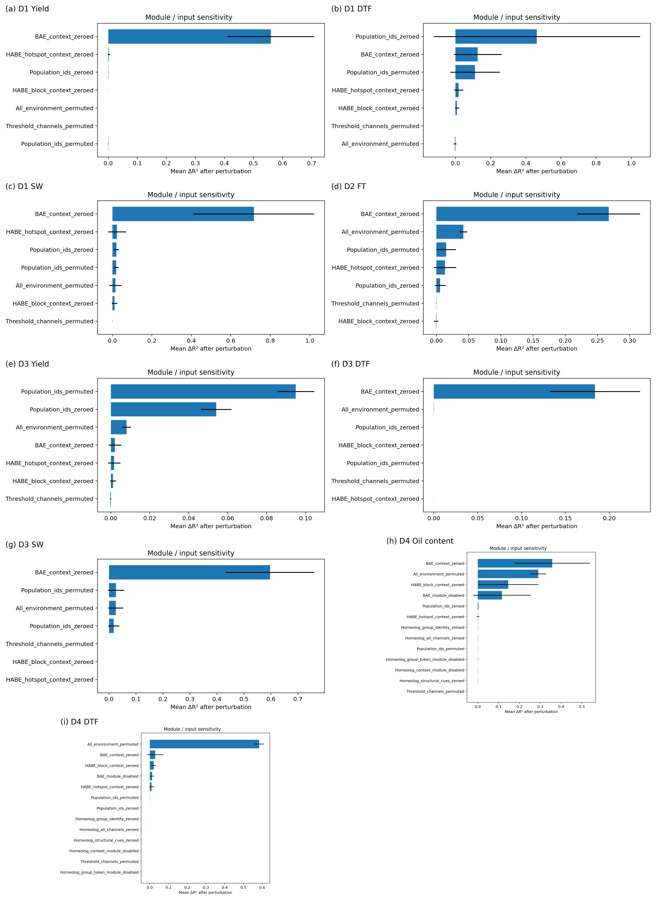
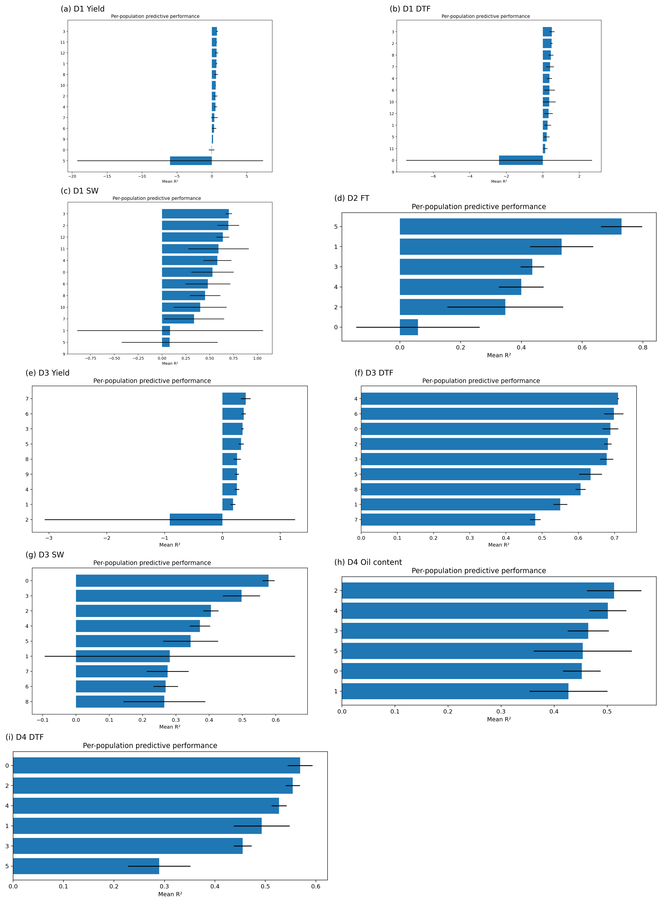
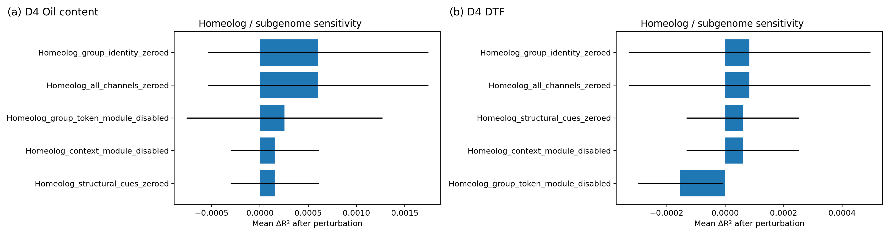

# Supplementary Figures and Tables for EcoPopDL-GP

This page hosts the supplementary material that will be linked from the manuscript.
Figure numbering and titles follow the manuscript order exactly for **Figures S2-S5** and **Tables S2-S5**.

## Supplementary Figures

### Figure S2. Temporal-window perturbation sensitivity across tasks.

  

*Caption.* Each panel shows the mean ΔR² after sample-wise permutation of one temporal window in the environmental sequence for a given dataset-trait task. Positive values indicate reduced predictive performance after perturbation. These profiles therefore quantify reliance on temporally localized environmental signal rather than identifying exact causal developmental windows. Panels are shown in a consistent task order to facilitate comparison across datasets and traits.

### Figure S3. Stage×feature perturbation sensitivity across tasks.

  

*Caption.* Each cell summarizes the mean ΔR² after sample-wise permutation of one environmental feature within one temporal stage. These panels therefore quantify post-hoc reliance on stage-specific environmental signal rather than causal effects of individual variables. Panels are shown in a consistent task order to facilitate comparison across datasets and traits. Missing panels indicate analyses that were still running when the figure was generated and can be updated later without changing the layout.

### Figure S4. Module and input perturbation sensitivity across tasks.

  

*Caption.* Each panel shows mean ΔR² after perturbing one input group or model component. Environmental and metadata inputs were perturbed by sample-wise permutation when appropriate, whereas BAE- and HABE-related genomic groups were evaluated by channel occlusion implemented by zeroing selected genomic channels. Panels are ordered consistently across tasks to support side-by-side comparison.

### Figure S5. Per-population held-out predictive performance across tasks.

  

*Caption.* Each panel shows mean held-out R² within inferred population groups for one dataset-trait task under within-genotype environment-holdout cross-validation. Error bars indicate variability across folds. This figure reports subgroup performance summaries rather than perturbation-based importance. Panels are ordered consistently across tasks to facilitate comparison of subgroup performance across datasets and traits. Missing panels indicate analyses that were still running when the figure was generated and can be updated later without changing the layout.

### Figure S6. Homoeolog-related perturbation sensitivity in the polyploid D4 dataset.

  

*Caption.* Panels show mean ΔR² after perturbing homoeolog-aware channels or temporarily disabling homoeolog-related modules for D4 Oil content and D4 days to flowering. These analyses were specific to the polyploid dataset and are shown separately from the shared perturbation panels.

## Supplementary Results Tables

### Table S2. Full ChromoMap channel inventory.

| Channel group | Description | Dataset-specific use |
|---|---|---|
| Dosage state | Normalized allele dosage and encoded dosage state used by BAE | All datasets |
| Positional channels | Chromosome identity, within-chromosome order, and padding mask | All datasets |
| Haplotype / LD context | Block ID, normalized block properties, LD-derived context summaries | All datasets |
| Gene annotation | Gene overlap / proximity features | All datasets |
| Promoter annotation | Promoter overlap indicators / proximity features | When promoter annotation available |
| TE annotation | TE overlap / proximity features | All datasets |
| Hotspot mask | Binary flag used by HABE to retain loci as individual tokens; set from SNP-level annotation (transposable element, gene body, promoter) and block-level summaries (high gene count, SNP density, or mean minor allele frequency) | Annotation-dependent |
| Population metadata | Population-cluster assignments inferred by ADMIXTURE | All datasets |
| Subgenome label | Subgenome identity for polyploid chromosomes | Polyploid only |
| Homoeolog presence | Indicator that a locus belongs to an annotated homoeolog group | Polyploid only |
| Homoeolog group size | Normalized homoeolog-group size | Polyploid only |
| Homoeolog group identity | Raw or hash-encoded group identifier | Polyploid only |
| Homoeolog anchor density | Local density of annotated homoeolog anchors | Polyploid only |

### Table S3. Complete predictive performance across all datasets under within-genotype environment-holdout cross-validation.

Wall-clock time is reported in minutes. Higher R² and CCC indicate better performance; lower MAE and RMSE indicate better performance. Abbreviations: **EcoPop** = EcoPopDL-GP; **LMET** = LearnMET; **DGxE** = DeepG×E; **SW** = seed weight; **DTF** = days to flowering; **FT** = flowering time. Entries marked **—** indicate values not generated because of memory constraints.

#### D1 Yield

| Model | Time | R² | MAE | RMSE | CCC |
|---|---:|---:|---:|---:|---:|
| **EcoPop** | 60 | **0.62** | **51.6** | **65.2** | **0.77** |
| GBLUP | 3 | 0.46 | 56.5 | 70.87 | 0.64 |
| BRR | 10 | 0.40 | 61.7 | 75.5 | 0.63 |
| RF | 20 | 0.47 | 56.3 | 70.3 | 0.64 |
| XGB | 20 | 0.47 | 56.2 | 70.6 | 0.65 |
| LMET | 30 | 0.44 | 57.2 | 70.7 | 0.61 |
| DGxE | 75 | 0.36 | 63.4 | 79.8 | 0.57 |

#### D1 DTF

| Model | Time | R² | MAE | RMSE | CCC |
|---|---:|---:|---:|---:|---:|
| **EcoPop** | 45 | **0.59** | **1.4** | **1.9** | **0.74** |
| GBLUP | 1 | 0.53 | 1.6 | 2.1 | 0.68 |
| BRR | 7 | 0.39 | 1.9 | 2.4 | 0.68 |
| RF | 15 | 0.53 | 1.6 | 2.2 | 0.71 |
| XGB | 15 | 0.49 | 1.8 | 2.2 | 0.70 |
| LMET | 20 | 0.44 | 1.8 | 2.4 | 0.63 |
| DGxE | 50 | 0.54 | 1.9 | 2.7 | 0.68 |

#### D1 SW

| Model | Time | R² | MAE | RMSE | CCC |
|---|---:|---:|---:|---:|---:|
| **EcoPop** | 50 | **0.59** | **22.5** | **29.4** | **0.73** |
| GBLUP | 3 | 0.49 | 24.9 | 32.9 | 0.66 |
| BRR | 9 | 0.48 | 25.1 | 33.1 | 0.67 |
| RF | 17 | 0.52 | 24.3 | 32.4 | 0.69 |
| XGB | 17 | 0.53 | 24.2 | 32.6 | 0.69 |
| LMET | 30 | 0.42 | 25.4 | 34.3 | 0.66 |
| DGxE | 60 | 0.48 | 22.6 | 32.4 | 0.67 |

#### D2 FT

| Model | Time | R² | MAE | RMSE | CCC |
|---|---:|---:|---:|---:|---:|
| **EcoPop** | 62 | **0.50** | **10.9** | **19.7** | **0.65** |
| GBLUP | 3 | 0.37 | 13.8 | 23.5 | 0.52 |
| BRR | 12 | 0.36 | 13.6 | 23.2 | 0.57 |
| RF | 20 | 0.45 | 12.4 | 21.8 | 0.62 |
| XGB | 20 | 0.40 | 13.5 | 25.3 | 0.59 |
| LMET | 35 | 0.40 | 11.8 | 21.6 | 0.58 |
| DGxE | 65 | 0.47 | 13.2 | 20.4 | 0.63 |

#### D3 Yield

| Model | Time | R² | MAE | RMSE | CCC |
|---|---:|---:|---:|---:|---:|
| **EcoPop** | 3180 | **0.45** | **4.87** | **7.13** | **0.62** |
| GBLUP | 150 | 0.34 | 5.13 | 7.69 | 0.51 |
| BRR | 180 | 0.34 | 5.09 | 7.60 | 0.50 |
| RF | 600 | 0.34 | 5.08 | 7.62 | 0.51 |
| XGB | 825 | 0.34 | 5.08 | 7.62 | 0.52 |
| LMET | — | — | — | — | — |
| DGxE | 4320 | -0.06 | 7.66 | 9.98 | 0.10 |

#### D3 DTF

| Model | Time | R² | MAE | RMSE | CCC |
|---|---:|---:|---:|---:|---:|
| **EcoPop** | 3300 | **0.71** | **5.14** | **6.88** | **0.83** |
| GBLUP | 165 | 0.60 | 5.54 | 7.42 | 0.79 |
| BRR | 210 | 0.60 | 6.04 | 8.12 | 0.74 |
| RF | 720 | 0.65 | 5.51 | 7.22 | 0.79 |
| XGB | 910 | 0.66 | 5.58 | 7.42 | 0.79 |
| LMET | — | — | — | — | — |
| DGxE | 4566 | 0.30 | 8.48 | 10.49 | 0.53 |

#### D3 SW

| Model | Time | R² | MAE | RMSE | CCC |
|---|---:|---:|---:|---:|---:|
| **EcoPop** | 3720 | **0.62** | **3.56** | **5.34** | **0.75** |
| GBLUP | 210 | 0.43 | 4.75 | 6.59 | 0.63 |
| BRR | 255 | 0.42 | 4.66 | 6.64 | 0.57 |
| RF | 865 | 0.46 | 4.49 | 6.46 | 0.64 |
| XGB | 1080 | 0.47 | 4.38 | 6.36 | 0.64 |
| LMET | — | — | — | — | — |
| DGxE | 4900 | 0.33 | 5.11 | 7.63 | 0.59 |

#### D4 Oil content

| Model | Time | R² | MAE | RMSE | CCC |
|---|---:|---:|---:|---:|---:|
| **EcoPop** | 45 | **0.56** | **1.58** | **1.98** | **0.71** |
| GBLUP | 7 | 0.48 | 1.68 | 2.18 | 0.64 |
| BRR | 5 | 0.46 | 1.74 | 2.23 | 0.63 |
| RF | 20 | 0.44 | 1.77 | 2.26 | 0.59 |
| XGB | 22 | 0.47 | 1.70 | 2.20 | 0.63 |
| LMET | 305 | 0.39 | 1.86 | 2.35 | 0.56 |
| DGxE | 110 | 0.33 | 2.00 | 2.57 | 0.55 |

#### D4 DTF

| Model | Time | R² | MAE | RMSE | CCC |
|---|---:|---:|---:|---:|---:|
| **EcoPop** | 32 | **0.52** | **1.85** | **2.41** | **0.70** |
| GBLUP | 6 | 0.46 | 2.34 | 3.14 | 0.63 |
| BRR | 5 | 0.43 | 2.39 | 3.22 | 0.63 |
| RF | 18 | 0.46 | 2.38 | 3.13 | 0.63 |
| XGB | 19 | 0.45 | 2.28 | 3.17 | 0.65 |
| LMET | 280 | 0.42 | 2.51 | 3.33 | 0.59 |
| DGxE | 90 | 0.29 | 2.85 | 3.86 | 0.58 |

### Table S4. Comparison of the two cross-validation settings.

Primary results in the main text are reported under within-genotype environment-holdout cross-validation. Genotype-grouped cross-validation is shown as a robustness check.

| Dataset | Trait | EcoPop geno-CV | EcoPop env-CV | Best baseline geno-CV | Best baseline env-CV |
|---|---|---:|---:|---:|---:|
| D1 | Yield | 0.58 | 0.62 | 0.43 | 0.47 |
| D1 | DTF | 0.51 | 0.59 | 0.50 | 0.54 |
| D1 | SW | 0.52 | 0.59 | 0.51 | 0.53 |
| D2 | FT | 0.48 | 0.50 | 0.44 | 0.47 |
| D3 | Yield | 0.43 | 0.45 | 0.33 | 0.34 |
| D3 | DTF | 0.68 | 0.71 | 0.64 | 0.66 |
| D3 | SW | 0.60 | 0.62 | 0.45 | 0.47 |
| D4 | Oil | 0.56 | 0.56 | 0.46 | 0.48 |
| D4 | DTF | 0.51 | 0.52 | 0.43 | 0.46 |

*Note.* **geno-CV** = genotype-grouped cross-validation; **env-CV** = within-genotype environment-holdout cross-validation.

### Table S5. Qualitative summary of mixed post-hoc perturbation sensitivity analyses.

Entries summarize the dominant patterns observed after sample-wise permutation of environmental or metadata signals, channel occlusion of structured genomic inputs, and, for selected D4 components, temporary module disablement.

| Dataset | Trait | Temporal-window profile | Dominant stage/feature groups | Strongest module/input perturbations | Per-population pattern | Homoeolog effect |
|---|---|---|---|---|---|---|
| D1 | Yield | Broad profile with modest mid-to-late emphasis | Heat, Vapour pressure deficit, drought (later stage) | BAE strongest; other perturbations smaller | Highly heterogeneous, including one strongly negative group | -- |
| D1 | DTF | Distributed; no single dominant window | Daylength, growing degree days, photo-thermal temperature | Population identifiers, then BAE | Heterogeneous | -- |
| D1 | SW | Distributed across windows | Temperature and photo-thermal features | BAE strongest; HABE secondary | Heterogeneous | -- |
| D2 | FT | Distributed across windows | Daylength, growing degree days, photo-thermal temperature | BAE with additional environmental contribution | Heterogeneous | -- |
| D3 | Yield | Flatter profile | Weak stage localization; broad environmental effects | Population identifiers largest; environmental perturbation smaller | One lower-performing group, including a negative mean R² group | -- |
| D3 | DTF | Weak, diffuse profile with small mid-to-late peaks; no single dominant window | Mid-stage minimum temperature and growing degree days; smaller later-stage thermal effects | BAE strongest; environmental, population, and HABE perturbations small | All displayed groups positive; moderate heterogeneity across populations | -- |
| D3 | SW | Weak, diffuse profile with no single dominant window; modest mid-to-late peaks with broad uncertainty | Late-stage heat-related degree days strongest; smaller positive changes for late maximum temperature and drought/Vapour pressure deficit-related features; most other cells weak or near zero | BAE strongest by a wide margin; population and full-environment perturbations small; HABE and threshold perturbations near zero | All displayed groups positive; moderate heterogeneity, with one lower-performing group showing wide uncertainty | -- |
| D4 | Oil content | Later-window emphasis | Late heat, Vapour pressure deficit, drought | BAE and environment strongest; HABE secondary | All displayed groups positive | Small |
| D4 | DTF | Later-window emphasis | Daylength, growing degree days, photo-thermal temperature | Environment strongest; BAE and HABE smaller | All displayed groups positive | Small |
