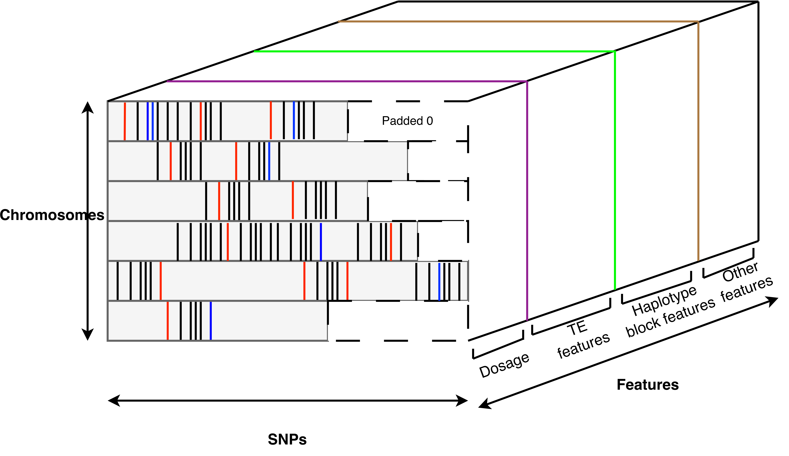
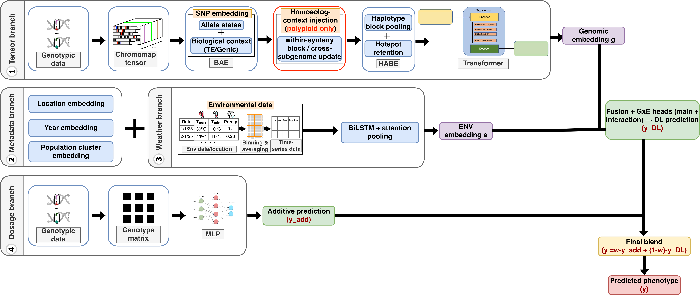

# EcoPopDL-GP

EcoPopDL-GP is a deep-learning pipeline for population-aware and environment-aware genomic prediction. This repository combines genotype preprocessing, phenotype preparation, ADMIXTURE-based population structure, environmental matrix construction, ChromoTensor generation, and diploid/polyploid model training.

The repository now includes a single entry script, `run.sh`, so the workflow can start from different genotype entry points and run through the later stages in one command.

## Pipeline overview


*End-to-end view of preprocessing, population-structure analysis, haplotype-block construction, ChromoTensor generation, and prediction.*

## Supplementary material

The GitHub-rendered supplementary figures and tables that match the manuscript numbering are available here:

- [Supplementary figures and tables](Manuscript/Supplementary/SUPPLEMENTARY.md)

## What `run.sh` does

The launcher can run these stages:

1. genotype preprocessing
2. phenotype preprocessing
3. ADMIXTURE population clustering
4. environment matrix generation
5. ChromoTensor generation
6. model training

You can run one stage or the full pipeline with `--stages`.

## Supported genotype start points

This was the main place that needed to be generalized. The launcher now supports a generic genotype source plus a source type:

- `axiom` — raw Axiom export table
- `plink` — existing BED/BIM/FAM prefix
- `pfile` — existing PGEN/PVAR/PSAM prefix
- `vcf` — existing VCF/VCF.GZ file
- `auto` — infer the type from the path or its companion files

Recommended usage:

```bash
./run.sh \
  --genotype-source /path/to/input \
  --genotype-source-type auto
```

Examples of what `--genotype-source` can point to:

- raw Axiom table: `/path/to/axiom_export.tsv`
- PLINK prefix: `/path/to/plink_prefix`
- PLINK member file: `/path/to/plink_prefix.bed`
- PFILE prefix: `/path/to/plink_prefix`
- PFILE member file: `/path/to/plink_prefix.pgen`
- VCF: `/path/to/plink_prefi.vcf.gz`

Legacy flags are still supported:

- `--axiom-file`
- `--existing-plink-prefix`
- `--existing-pfile-prefix`
- `--vcf-source`

## How the genotype stage behaves

### If the source type is `axiom`

The launcher starts from the raw genotype table and runs the preprocessing chain described in `Scripts/Data_preparation/Genotype/Steps.md`:

- Axiom table to PED/MAP
- REF/ALT handling
- BED conversion
- QC
- chromosome-wise VCF export
- Beagle imputation
- dosage-aware VCF generation
- final BED/PED/MAP export
- haplotype block generation

### If the source type is `plink`

The launcher starts from an existing BED/BIM/FAM prefix and:

- copies or exports the needed files into the working directory
- creates a VCF if one is not provided
- creates PED/MAP
- creates haplotype blocks if they are not provided

If `RUN_BEAGLE_IMPUTATION=1` or `--run-beagle-imputation` is set, the launcher instead:

- copies the PLINK input into the workdir
- runs QC with the configured `--geno/--mind/--maf` thresholds
- exports chromosome-wise VCFs
- runs Beagle imputation
- rebuilds final BED/PED/MAP, VCF, and haplotype blocks from the imputed result

### If the source type is `pfile`

The launcher starts from an existing PGEN/PVAR/PSAM prefix and:

- converts it to BED/BIM/FAM
- exports or copies a VCF
- creates PED/MAP
- creates haplotype blocks if needed

With `RUN_BEAGLE_IMPUTATION=1` or `--run-beagle-imputation`, it follows the same QC + Beagle path after converting the PFILE to BED/BIM/FAM.

### If the source type is `vcf`

The launcher starts from an existing VCF and:

- compresses/indexes it into the working directory if needed
- converts it to PLINK2 PFILE, then BED/BIM/FAM
- creates PED/MAP
- creates haplotype blocks if needed

With `RUN_BEAGLE_IMPUTATION=1` or `--run-beagle-imputation`, it converts the VCF to BED/BIM/FAM, runs QC + Beagle, and rebuilds the final genotype outputs from the imputed result.

## Important note about “any file type”

The right design is to normalize supported raw inputs into one internal genotype schema before the later steps run. That is already how the launcher behaves for the supported entry points above:

- recognized raw Axiom-style text tables are normalized into the internal `probeset_id / Chr_id / Start / Strand + sample columns` representation before PLINK export
- existing PLINK, PFILE, and VCF inputs are normalized through their own import paths into the same downstream pipeline products

The launcher still does **not** support completely arbitrary genotype layouts. If your data is not one of the supported starts, it should first be converted to one of these:

- Axiom-like raw table
- PLINK BED/BIM/FAM
- PLINK2 PFILE
- VCF

The bundled polyploid example is one such normalization case: it starts from a marker-by-sample allele-call text matrix and is converted internally before QC, Beagle, ADMIXTURE, and tensor generation.

## Repository additions for reproducible runs

These helper files were added to make the pipeline runnable without editing the original research scripts directly:

- `run.sh`
- `config/run.example.env`
- `Scripts/utils/render_configured_script.py`
- `Scripts/utils/make_pheno_files_cli.py`
- `Scripts/utils/build_trial_file_cli.py`
- `Scripts/utils/admixture_assign_cli.py`
- `Scripts/utils/merge_population_clusters.py`
- `Scripts/utils/parse_admixture_cv.py`
- `Scripts/Model/Polyploid/gxe_transformer_temporal_D4_homfix_homgroup_signal.py`

## Requirements

### System tools

Expected in the environment:

- Python 3.10+
- Java
- `bcftools`
- `samtools` for FASTA indexing when needed
- `admixture` if you want ADMIXTURE clustering

Bundled under `Scripts/Data_preparation/Genotype/`:

- `plink`
- `plink2`
- `tabix`
- `beagle.06Aug24.a91.jar`

If the bundled binaries do not run on your system, pass your own paths:

```bash
./run.sh --plink /usr/local/bin/plink --plink2 /usr/local/bin/plink2 --tabix /usr/bin/tabix
```

### Python packages

At minimum, the current scripts expect packages such as:

```bash
pip install numpy pandas matplotlib scikit-learn torch pysam cyvcf2 dask tqdm pyarrow pandas-plink
```

Depending on your run, you may also need packages referenced deeper in the training or tensor scripts.

## Input files expected by the pipeline

### Genotype

Use the generic source settings in the config file:

```bash
GENOTYPE_SOURCE_TYPE=auto
GENOTYPE_SOURCE=/path/to/input
```

Optional companion files:

- `EXISTING_VCF` — if you already have a preferred VCF for a PLINK/PFILE start
- `EXISTING_HAP_BLOCK_FILE` — if you already generated haplotype blocks

### Phenotype

The phenotype table should contain at least:

- sample column, default `Name`
- location column, default `Location`
- year column, default `Year`
- trait column passed with `--trait-col`
- optional population column, default `Pop`

The helper phenotype CLI writes:

- model metadata CSV: `metadata_<trait>.csv`
- overall phenotype file
- covariate files when requested
- replicate-aware mean phenotype file: `<trait>_mean.txt`

If `GROUP_COLS` / `--group-cols` is left blank, the phenotype helper auto-detects extra grouping columns conservatively so replicate/design columns are preserved instead of being averaged away accidentally.

If the ADMIXTURE stage runs, the launcher also writes:

- `01_admixture/sample_clusters.csv`
- phenotype files merged with cluster assignments, including `<trait>_mean_with_admixture.txt`

Example phenotype input:

```csv
Name,Location,Year,SD,Pop,Yield
WCC100-7,Lucky Lake,2019,1,3,121.1
WCC100-7,Lucky Lake,2019,2,3,123.65
WCC100-7,Moose Jaw,2019,1,3,305.605
WCC100-7,Moose Jaw,2019,2,3,140.4333333
```

In this example, the phenotype helper keeps `SD` as a design column and writes a replicate-aware mean table such as `yield_mean.txt` with one row per `sample + location + year (+ any preserved design columns)`.

### Environment

The explicit trial/environment table should contain fields like:

- `sample_id`
- `start`
- `end`
- either `lat` and `lon`
- or a geocodable `place`, `location`, or `Location`

Example explicit trial file:

```csv
sample_id,lat,lon,start,end,place
WCC100-7,50.9853,-107.1330,2019-05-01,2019-09-30,Lucky Lake
WCC102-4,50.9853,-107.1330,2019-05-01,2019-09-30,Lucky Lake
```

You can also omit `TRIAL_FILE` and let `run.sh` build it from a simpler phenotype-like table. In that mode:

- `ENV_SOURCE_FILE` defaults to `TRAIT_FILE` if not set separately
- `ENV_SAMPLE_COL`, `ENV_LOCATION_COL`, and `ENV_YEAR_COL` default to the phenotype column settings
- you must provide either explicit date columns with `ENV_START_COL` and `ENV_END_COL`, or season settings such as `ENV_SEASON_START_MM_DD` plus `ENV_SEASON_END_MM_DD` or `ENV_SEASON_LENGTH_DAYS`
- if only `Location` or `place` is available, the environment builder can geocode latitude and longitude automatically

Example config for auto-building the trial file from the phenotype table:

```bash
TRAIT_FILE=/path/to/Yield_D1.csv
TRIAL_FILE=
ENV_SOURCE_FILE=
ENV_SEASON_START_MM_DD=05-01
ENV_SEASON_END_MM_DD=09-30
```

If you already have exact planting and harvest dates, prefer the explicit `TRIAL_FILE` path because it is more precise than a fixed seasonal window.

### Optional annotation inputs

- `--gene-gff`
- `--te-annotation`
- `--te-gff`
- `--homoeolog-pairs`

Notes:

- Use either `--te-annotation` or `--te-gff`, not both.
- `--te-gff` is converted automatically into the TE-annotation TSV schema used by the tensor scripts.
- For polyploid tensor generation, both `--gene-gff` and `--homoeolog-pairs` are required.

### ChromoMap tensor representation



*Example chromosome-strip tensor layout used by the tensor-generation stage, with padded regions and per-chromosome rows preserved for downstream modeling.*

### EcoPopDL-GP model architecture



*High-level architecture of the genomic tensor branch, metadata branch, weather branch, dosage branch, and the final fusion used for phenotype prediction. The homoeolog-context block is used in polyploid mode only.*

## Running the best (automated) model

`run.sh` runs the base model. To run the **automated configuration reported in the paper**, use the
wrapper `run_best_model.sh`. It accepts every `run.sh` option and adds the automated-model settings
on top:

```bash
./run_best_model.sh \
  --mode diploid \
  --workdir out/d1_yield \
  --genotype-source /data/D1/geno \
  --trait-file /data/D1/pheno.csv \
  --trait-col Yield \
  --trial-file /data/D1/trials.csv
```

The learnable gate is enabled by default and needs no extra files. The two optional components
switch on only when you supply their inputs:

```bash
./run_best_model.sh \
  --aux-pheno /data/D1/aux_traits.csv --aux-targets Flowering,SW \
  --genic-ids /data/D1/genic_snps.txt \
  ... # plus the usual run.sh options
```

| Wrapper flag | Effect |
|---|---|
| *(default)* | **Learnable dual-branch gate**: the additive/deep mixing weight `w` is learned instead of fixed |
| `--aux-pheno` + `--aux-targets` | **Multi-trait auxiliary heads**: extra traits supervise a shared representation |
| `--aux-weight FLOAT` | Loss weight for the auxiliary heads (default `0.2`) |
| `--genic-ids FILE` | **Genic-restricted additive branch**: keep only the listed SNP IDs in the additive branch |
| `--no-gate` | Disable the learnable gate (revert to the fixed mixing weight) |
| `--seed INT` | Set the random seed |

### Advanced: configuring the engine directly

Both training engines are configured through `ECOPOP_*` environment variables, so any option can be
set without editing code. The most useful ones:

| Variable | Purpose |
|---|---|
| `ECOPOP_DOSAGE_WEIGHT` | `learn` for the learnable gate, otherwise a fixed weight |
| `ECOPOP_AUX_PHENO`, `ECOPOP_AUX_TARGETS`, `ECOPOP_AUX_WEIGHT` | Multi-trait auxiliary heads |
| `ECOPOP_ADDITIVE_GENIC_IDS` | Restrict the additive branch to a SNP-ID list |
| `ECOPOP_EVAL_MODE` | `env` (env-CV), `geno` (geno-CV), `env_blocked`, or `population` |
| `ECOPOP_ENV_BLOCKED_MODES` | Which blocking schemes to run: `location`, `year`, `loc_year` |
| `ECOPOP_ENV_WINDOW_FRAC` | Fraction of the season to use, for partial-season / early selection |
| `ECOPOP_USE_BAE`, `ECOPOP_USE_HABE`, `ECOPOP_USE_ADDITIVE`, `ECOPOP_USE_POP`, `ECOPOP_ABLATE_WEATHER` | Component ablations |
| `ECOPOP_SEED`, `ECOPOP_CV_FOLDS` | Reproducibility and fold count |
| `ECOPOP_3D_CHANNELS`, `ECOPOP_3D_PATH` | Optional 3D-genome channels (polyploid engine only) |

`run_experiments.sh` drives the full evaluation protocol (env-CV, geno-CV, environment-blocked,
population-blocked, ablations, partial-season) across tasks, and the helpers in `Scripts/Model/`
(`emit_best_reg.py`, `collect_metrics.py`, `build_results_table.py`, `eval_env_blocked.py`,
`aggregate_multiseed.py`) reproduce the tables in the manuscript.

## Quick start examples

Unless you need to force a specific grouping scheme, leave `--group-cols` unset and let the phenotype helper infer replicate-preserving grouping automatically.

### 1) Start from sample PLINK files

```bash
./run.sh \
  --mode diploid \
  --workdir runs/demo_d1 \
  --stages genotype,phenotype,env \
  --genotype-source Scripts/Sample_data/chickpea_axiom_raw \
  --genotype-source-type plink \
  --run-beagle-imputation \
  --trait-file Scripts/Sample_data/Yield_D1.csv \
  --trait-col Yield \
  --target-col Yield \
  --trial-file Scripts/Sample_data/trial_data_d1.csv \
  --covariate-cols Year,SD \
  --skip-admixture
```

### 2) Start from raw Axiom table

```bash
./run.sh \
  --mode diploid \
  --workdir runs/diploid_yield \
  --genotype-source /path/to/axiom_export.tsv \
  --genotype-source-type axiom \
  --genotype-output-prefix d1_axiom \
  --ref-mode genome \
  --fasta /path/to/reference.fa \
  --trait-file /path/to/Yield_D1.csv \
  --trait-col Yield \
  --target-col Yield \
  --trial-file /path/to/trial_data_d1.csv \
  --covariate-cols Year,SD \
  --gene-gff /path/to/genes.gff3 \
  --te-annotation /path/to/te_gene_annotation.tsv
```

For raw-Axiom starts, set `GENOTYPE_OUTPUT_PREFIX` in the config or pass `--genotype-output-prefix` so intermediate files are labeled with your dataset name instead of a stale species/example prefix. If you leave it blank, `run.sh` now derives it from the input filename.

### 3) Start from existing PLINK files with auto detection

```bash
./run.sh \
  --mode polyploid \
  --workdir runs/polyploid_oil \
  --genotype-source /path/to/imp.qc.all.withdc.clean.fixed.bed \
  --genotype-source-type auto \
  --trait-file /path/to/D4_OIL_DB.csv \
  --trait-col OIL_DB \
  --target-col OIL_DB \
  --trial-file /path/to/trial_data_d4.csv \
  --gene-gff /path/to/Bnapus_3DH.genes_20211001.gff3 \
  --te-annotation /path/to/te_gene_annotation.tsv \
  --homoeolog-pairs /path/to/Bnapus_A_C_homoeolog_pairs.tsv
```

### 4) Run from a config file

```bash
cp config/run.example.env config/my_run.env
./run.sh --config config/my_run.env
```

## Stage selection

Available stage names:

- `genotype`
- `phenotype`
- `admixture`
- `env`
- `tensors`
- `train`
- `all`

Dependencies are expanded automatically. For example:

- `--stages train` runs required upstream stages first
- `--stages tensors` prepares genotype assets and then builds tensors
- `--stages phenotype` only processes phenotype data

## Output layout

Inside the selected work directory:

```text
00_genotype/
01_admixture/
02_phenotype/
03_environment/
04_tensors/
05_train/
tmp/
logs/
```

## Notes on the original research scripts

The original tensor and training scripts contain hard-coded values from the development environment. The launcher still renders configured runtime copies into:

```text
<workdir>/tmp/
```

That keeps runs reproducible. Some source scripts in the repository also now include portability and compatibility fixes used by the launcher.

## Example config

See:

```text
config/run.example.env
```

That file now shows the generic genotype entry settings explicitly, so the start of the pipeline can change depending on whether the run begins from Axiom, PLINK, PFILE, or VCF.

It also shows current options such as:

- `RUN_BEAGLE_IMPUTATION`
- automatic phenotype grouping via blank `GROUP_COLS`
- `TE_GFF` support
- `ADMIXTURE_SELECTION_METHOD=elbow`

## Contact 📬
===============

For any questions or inquiries, please feel free to open an issue on our repository or contact us at [qnm481@usask.ca](mailto:qnm481@usask.ca).

## License 📜
===============

This project is licensed under the [MIT License](LICENSE)
